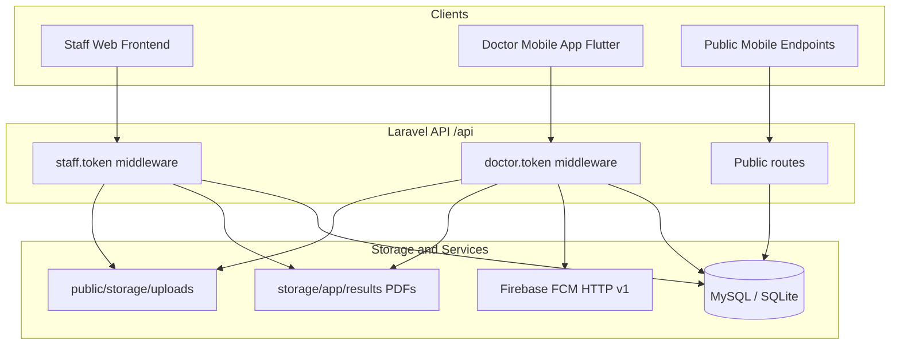
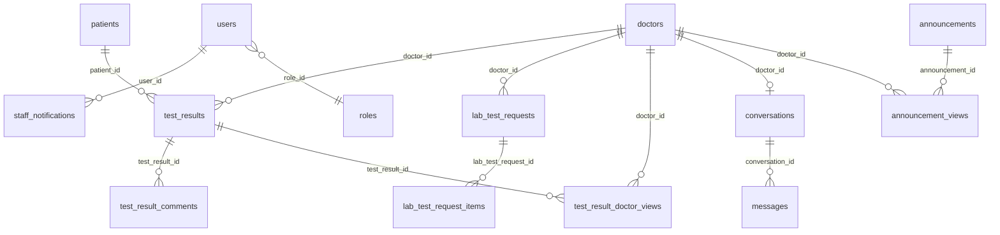
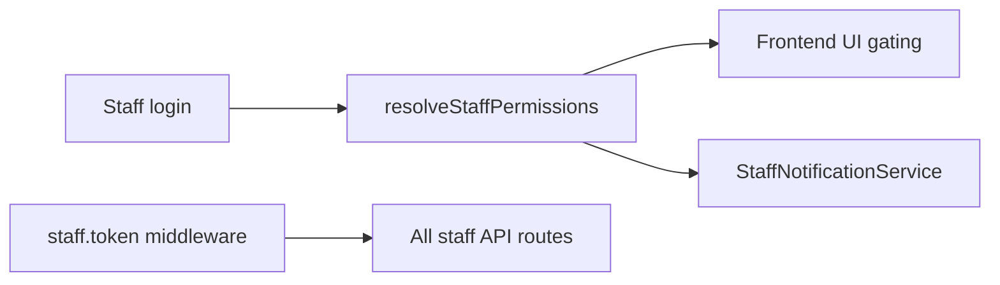

# Alsaleem Call Center — System Deliverables Handoff

This document is the authoritative handoff for producing final client deliverables (user manuals, deployment guides, API specifications, training materials). It consolidates scope, schema, API reference, setup, roles, configuration, and known issues from the Laravel backend codebase.

**Stack:** PHP ^8.2, Laravel ^12, MySQL/SQLite, FCM HTTP v1 (Firebase)

**Base URL:** All API routes are prefixed with `/api` (e.g. `https://your-host.com/api/doctor/login`).

---

## Table of contents

1. [Scope of work](#1-scope-of-work)
2. [Database migrations, schema, and seeders](#2-database-migrations-schema-and-seeders)
3. [API documentation](#3-api-documentation)
4. [Setup and configuration documentation](#4-setup-and-configuration-documentation)
5. [User roles and permissions](#5-user-roles-and-permissions)
6. [Required environment variables](#6-required-environment-variables)
7. [Notes on configuration files](#7-notes-on-configuration-files)
8. [Open bugs](#8-open-bugs)
9. [Minor issues](#9-minor-issues)
10. [Deferred enhancements](#10-deferred-enhancements)

---

## 1. Scope of work

### 1.1 System overview

The **Alsaleem Call Center** backend is an **API-only Laravel application**. It does not serve an active server-rendered web UI (`routes/web.php` is fully commented out). Two separate frontends consume the API:

| Client | Authentication | Purpose |
|--------|----------------|---------|
| Staff web frontend (separate repo) | `Authorization: Bearer <staff_token>` | Admin CRUD, doctor chat, patient/result management, lab request review, in-app notifications |
| Doctor mobile app (Flutter) | `Authorization: Bearer <doctor_token>` | Results, patients, chat, announcements, lab catalog/requests, FCM push notifications |
| Public mobile endpoints | None | Home sliders, lab test catalog |

### 1.2 In scope (backend)

- Token-based authentication for staff and doctors (multi-device tokens)
- Role and permission model (UI gating + staff notification routing)
- Doctor–staff chat with DB polling and file attachments via `/api/upload`
- Test results with **private PDF storage** (authenticated download only)
- Patients table with global deduplication (`name`, `birth_year`, `gender`)
- Result comment threads (doctor ↔ staff) with unseen-badge tracking
- Lab test request workflow (doctor submit → staff review → status push to doctor)
- Staff in-app notifications (permission-scoped) + doctor FCM push notifications
- Admin CRUD: users, roles, doctors, announcements, sliders, lab tests, lab branches, specialties

### 1.3 Out of scope / not active

- Legacy server-rendered staff web UI (routes commented out in `routes/web.php`)
- Server-side enforcement of granular permission keys on API routes (frontend responsibility)
- Staff Postman collection (doctor-only collection exists, partially stale)
- Dedicated Docker/CI deployment guide

### 1.4 Architecture



### 1.5 Related documentation (source detail)

| Topic | File |
|-------|------|
| Backend overview (partially outdated) | `BACKEND_OVERVIEW.md` |
| Admin API for staff frontend | `FRONTEND_ADMIN_API.md` |
| Roles API | `ROLES_API.md` |
| Patients migration | `docs/01-patients-table-migration.md` |
| Patients & results API | `docs/02-patient-and-results-api.md` |
| Lab test requests | `docs/03-lab-test-requests-api.md` |
| Staff notifications | `docs/04-staff-notifications.md` |
| Doctor mobile handover | `docs/frontend/doctor/README.md` |
| Mobile chat | `MOBILE_CHAT_BACKEND.md` |
| Mobile push | `MOBILE_PUSH_NOTIFICATIONS.md` |
| FCM setup | `FCM_SETUP.md` |
| Staff chat | `FRONTEND_CHAT_FLOW.md` |

---

## 2. Database migrations, schema, and seeders

### 2.1 Migration inventory (42 files)

#### Core Laravel

| Migration | Tables |
|-----------|--------|
| `0001_01_01_000000_create_users_table.php` | `users`, `password_reset_tokens`, `sessions` |
| `0001_01_01_000001_create_cache_table.php` | `cache`, `cache_locks` |
| `0001_01_01_000002_create_jobs_table.php` | `jobs`, `job_batches`, `failed_jobs` |

#### Domain (2025)

| Migration | Tables / changes |
|-----------|------------------|
| `2025_09_21_000001_add_role_to_users_table.php` | `users.role` (legacy string) |
| `2025_09_21_000002_create_doctors_table.php` | `doctors` |
| `2025_09_21_000003_create_test_results_table.php` | `test_results` (original: `patient_name`, `doctor_comment`, etc.) |
| `2025_09_21_000004_create_announcements_table.php` | `announcements` |
| `2025_09_21_000005_create_sliders_table.php` | `sliders` |
| `2025_09_21_000006_create_conversations_and_messages_tables.php` | `conversations`, `messages` |
| `2025_09_21_000007_add_api_token_to_doctors_table.php` | `doctors.api_token` (later migrated away) |
| `2025_09_21_000008_add_activity_fields_to_conversations.php` | Conversation activity fields |
| `2025_09_21_000009_create_lab_tests_table.php` | `lab_tests` |
| `2025_10_11_220721_create_lab_branches_table.php` | `lab_branches` |
| `2025_10_11_221519_create_announcement_views_table.php` | `announcement_views` |
| `2025_10_18_094920_add_branch_assignment_to_users_table.php` | `users.branch_assignment` |
| `2025_10_18_094958_add_phone_to_doctors_table.php` | `doctors.phone` |
| `2025_10_18_095039_add_hospital_to_test_results_table.php` | `test_results.hospital` |
| `2025_10_18_095117_add_targeting_to_announcements_table.php` | Announcement targeting |
| `2025_10_18_095219_add_media_to_announcements_table.php` | Announcement media |
| `2025_10_18_100725_modify_announcements_media_to_support_multiple.php` | Multiple media files |
| `2025_10_18_120435_add_fcm_token_to_doctors_table.php` | `doctors.fcm_token` |

#### Auth / RBAC (2026-03)

| Migration | Tables / changes |
|-----------|------------------|
| `2026_03_07_000001_add_patient_age_and_soft_deletes_to_test_results_table.php` | `patient_age`, `deleted_at` on results |
| `2026_03_07_000003_add_reply_to_id_to_messages_table.php` | `messages.reply_to_id` |
| `2026_03_07_000004_add_api_token_to_users_table.php` | `users.api_token` (later migrated away) |
| `2026_03_07_000005_create_specialties_table.php` | `specialties` |
| `2026_03_29_000001_create_roles_table.php` | `roles` (`name`, `slug`, `permissions` JSON) |
| `2026_03_29_000002_add_role_id_to_users_table.php` | `users.role_id` FK → `roles` |
| `2026_03_29_100000_add_bio_and_profile_picture_to_doctors_table.php` | `doctors.bio`, `profile_picture_path` |
| `2026_03_29_120000_create_staff_access_tokens_table.php` | `staff_access_tokens` |
| `2026_03_29_130000_create_doctor_access_tokens_table.php` | `doctor_access_tokens` |
| `2026_03_29_140000_add_soft_deletes_to_messages_table.php` | `messages.deleted_at` |
| `2026_03_29_150000_add_url_to_sliders_table.php` | `sliders.url` |

#### Doctor features (2026)

| Migration | Tables / changes |
|-----------|------------------|
| `2026_01_15_074630_update_doctors_experience_level_enum.php` | Experience level enum |
| `2026_01_15_080008_update_announcements_experience_levels.php` | Announcement targeting update |
| `2026_05_02_000001_create_test_result_doctor_views_table.php` | `test_result_doctor_views` |
| `2026_05_02_000002_create_doctor_lab_catalog_seens_table.php` | `doctor_lab_catalog_seens` |

#### June 2026 features (deploy before mobile app release)

| Migration | Description |
|-----------|-------------|
| `2026_06_10_000001_create_patients_and_migrate_test_results.php` | Creates `patients`; adds `patient_id` to `test_results`; drops `patient_name`, `patient_age` |
| `2026_06_10_000002_create_lab_test_requests_tables.php` | `lab_test_requests`, `lab_test_request_items` |
| `2026_06_10_000003_create_staff_notifications_table.php` | `staff_notifications` |
| `2026_06_10_000004_create_test_result_comments_table.php` | `test_result_comments`; migrates `doctor_comment` → first comment row; drops `doctor_comment` |
| `2026_06_10_000005_move_result_pdfs_to_private_storage.php` | File move: `public/storage/results/` → `storage/app/results/` (no schema change) |
| `2026_06_10_000006_add_comments_seen_at_to_test_result_doctor_views.php` | `test_result_doctor_views.comments_seen_at` |

### 2.2 Entity relationship diagram



### 2.3 Current schema (key tables)

#### `patients`

| Column | Type | Notes |
|--------|------|-------|
| `id` | bigint PK | |
| `name` | string | |
| `birth_year` | smallint, nullable | Derived from age at input |
| `gender` | string(20), default `unknown` | `male`, `female`, `other`, `unknown` |
| `created_at`, `updated_at` | timestamps | |
| **Unique** | `(name, birth_year, gender)` | Global deduplication |

Computed JSON field `age` = current year − `birth_year`.

#### `test_results` (current shape)

| Column | Type | Notes |
|--------|------|-------|
| `id` | bigint PK | |
| `patient_id` | FK → `patients` | nullable, `nullOnDelete` |
| `hospital` | string, nullable | |
| `lab_branch` | string | |
| `doctor_id` | FK → `doctors` | |
| `pdf_path` | string | Relative path on `local` disk (`results/{filename}.pdf`) |
| `created_at`, `updated_at` | timestamps | |
| `deleted_at` | timestamp, nullable | Soft deletes |

**Removed columns:** `patient_name`, `patient_age`, `doctor_comment`

#### `test_result_comments`

| Column | Type | Notes |
|--------|------|-------|
| `id` | bigint PK | |
| `test_result_id` | FK → `test_results` | cascade delete |
| `author_type` | string(20) | `doctor` or `staff` |
| `author_id` | unsigned bigint | → `doctors.id` or `users.id` |
| `body` | text | |
| `created_at`, `updated_at` | timestamps | |

#### `lab_test_requests`

| Column | Type | Notes |
|--------|------|-------|
| `id` | bigint PK | |
| `doctor_id` | FK → `doctors` | cascade delete |
| `status` | string(20), default `pending` | `pending`, `reviewed`, `approved`, `rejected` |
| `notes` | text, nullable | |
| `created_at`, `updated_at` | timestamps | |

#### `lab_test_request_items`

| Column | Type | Notes |
|--------|------|-------|
| `id` | bigint PK | |
| `lab_test_request_id` | FK → `lab_test_requests` | cascade delete |
| `test_name` | string | |
| `description` | text, nullable | |

Not linked to `lab_tests` catalog — staff add approved tests manually.

#### `staff_notifications`

| Column | Type | Notes |
|--------|------|-------|
| `id` | bigint PK | |
| `user_id` | FK → `users` | cascade delete |
| `type` | string | e.g. `doctor_message`, `doctor_result_comment` |
| `title` | string | Arabic by default |
| `body` | text | |
| `data` | json | Navigation payload (`route`, `entity_id`, etc.) |
| `read_at` | timestamp, nullable | |
| `created_at`, `updated_at` | timestamps | |

#### `test_result_doctor_views`

| Column | Type | Notes |
|--------|------|-------|
| `doctor_id` | FK → `doctors` | |
| `test_result_id` | FK → `test_results` | |
| `viewed_at` | timestamp | Result seen watermark |
| `comments_seen_at` | timestamp, nullable | Staff comments seen watermark |
| **Unique** | `(doctor_id, test_result_id)` | |

#### `doctors` (key columns)

| Column | Notes |
|--------|-------|
| `username`, `password` | Login credentials |
| `name`, `speciality`, `experience_level` | Profile (`specialist`, `doctor`, `consultant`) |
| `phone`, `bio`, `profile_picture_path` | Optional profile fields |
| `fcm_token` | Push notification token |

#### `users` (staff)

| Column | Notes |
|--------|-------|
| `name`, `email`, `password` | Login credentials |
| `role` | Legacy string: `admin`, `supervisor`, `agent` |
| `role_id` | FK → `roles` |
| `branch_assignment` | Optional branch filter |

#### `roles`

| Column | Notes |
|--------|-------|
| `name`, `slug` | Display name and URL-safe identifier |
| `permissions` | JSON object of boolean permission keys |

### 2.4 Breaking schema changes (June 2026)

| Change | Impact |
|--------|--------|
| `test_results.patient_name` / `patient_age` removed | Clients must use nested `patient` object or `patient_id` |
| `test_results.doctor_comment` removed | Use `/comments` thread endpoints |
| PDF files moved to private storage | Direct public URLs no longer work; use authenticated `/pdf` endpoints |
| New tables: patients, comments, lab requests, staff notifications | Require migration before app release |

### 2.5 Seeders

| Seeder | Command | Contents |
|--------|---------|----------|
| `DatabaseSeeder` | `php artisan db:seed` | Calls `SpecialtySeeder`, `RoleSeeder`; creates admin user, sample doctor, conversations |
| `SpecialtySeeder` | (via DatabaseSeeder) | 20 medical specialties (`name_en`, `name_ar`) |
| `RoleSeeder` | (via DatabaseSeeder) | `admin`, `supervisor`, `agent` roles with permission sets |
| `LoadTestSeeder` | `php artisan db:seed --class=LoadTestSeeder` | Bulk performance-test data (local/staging only) |

**Default seeded credentials:**

| Account | Email / Username | Password |
|---------|------------------|----------|
| Staff admin | `admin@example.com` | `password` |
| Sample doctor | `drsmith` | `password` |

**LoadTestSeeder env overrides:**

| Variable | Default |
|----------|---------|
| `LOAD_TEST_DOCTORS` | 20 |
| `LOAD_TEST_STAFF` | 10 |
| `LOAD_TEST_PATIENTS` | 5000 |
| `LOAD_TEST_RESULTS` | 25000 |
| `LOAD_TEST_COMMENTS` | 40000 |
| `LOAD_TEST_MESSAGES` | 10000 |
| `LOAD_TEST_ANNOUNCEMENTS` | 200 |
| `LOAD_TEST_LAB_TESTS` | 100 |
| `LOAD_TEST_LAB_BRANCHES` | 8 |
| `LOAD_TEST_LAB_REQUESTS` | 150 |
| `LOAD_TEST_NOTIFICATIONS` | 2000 |

---

## 3. API documentation

### 3.1 Cross-cutting conventions

| Topic | Detail |
|-------|--------|
| Base prefix | `/api` |
| Auth header | `Authorization: Bearer <token>` |
| Pagination | Laravel standard: `{ data, current_page, last_page, per_page, total, links, ... }` |
| Validation errors | `{ "message": "Validation failed", "errors": { "field": ["..."] } }` — HTTP 422 |
| PDF access | Authenticated endpoints only; `pdf_path` in JSON is an API URL, not a public file path |
| Staff permissions | Returned at login for UI gating; **not enforced** on API routes |
| Multipart | Result create/update, doctor profile, announcements, sliders use `multipart/form-data` |

---

### 3.2 Authentication

#### `POST /api/doctor/login`

| | |
|---|---|
| **Auth** | None |
| **Body** | `{ "username": "string", "password": "string", "device_name": "string?" }` |
| **Response 200** | `{ "token": "60-char string" }` |
| **Response 422** | Invalid credentials or validation errors |

#### `POST /api/doctor/logout`

| | |
|---|---|
| **Auth** | `doctor.token` |
| **Response 200** | `{ "ok": true }` |
| **Notes** | Revokes only the current device token |

#### `POST /api/staff/login`

| | |
|---|---|
| **Auth** | None |
| **Body** | `{ "email": "string", "password": "string", "device_name": "string?" }` |
| **Response 200** | `{ "token": "...", "user": { ...user fields, "permissions": { "chatting": true, ... } } }` |
| **Response 422** | Invalid credentials or validation errors |

#### `POST /api/staff/logout`

| | |
|---|---|
| **Auth** | `staff.token` |
| **Response 200** | `{ "ok": true }` |

---

### 3.3 Public endpoints

#### `GET /api/sliders`

| | |
|---|---|
| **Auth** | None |
| **Response 200** | Array (max 3): `[{ "id", "title", "image_url", "position", "url" }]` |

#### `GET /api/lab-tests`

| | |
|---|---|
| **Auth** | None |
| **Response 200** | Array: `[{ "id", "name", "description" }]` |

---

### 3.4 File upload

#### `POST /api/upload`

| | |
|---|---|
| **Auth** | None (uses `upload.limits` middleware only) |
| **Body** | `multipart/form-data` with field `file` (max ~50 MB) |
| **Response 201** | `{ "success": true, "url", "path", "filename", "original_name", "size", "mime_type" }` |
| **Notes** | Files stored in `public/storage/uploads/`. Used for chat attachments. |

---

### 3.5 Doctor API

All routes require `Authorization: Bearer <doctor_token>`.

#### Profile and device

##### `GET /api/doctor/me`

| | |
|---|---|
| **Response 200** | Doctor object: `id`, `name`, `username`, `speciality`, `experience_level`, `phone`, `bio`, `profile_picture_url`, etc. |

##### `PUT` / `POST /api/doctor/me`

| | |
|---|---|
| **Body** | `multipart/form-data` or JSON: `name?`, `username?`, `speciality?`, `experience_level?`, `password?`, `bio?`, `profile_picture?` (image, max 5 MB) |
| **Response 200** | Updated doctor object |
| **Notes** | Triggers `doctor_profile_updated` staff notification |

##### `POST /api/doctor/fcm-token`

| | |
|---|---|
| **Body** | `{ "fcm_token": "string" }` (max 1000 chars) |
| **Response 200** | `{ "success": true, "message": "FCM token updated successfully" }` |

#### Unseen badges

##### `GET /api/doctor/unseen-summary`

| | |
|---|---|
| **Response 200** | `{ "has_unseen": bool, "messages": { "unseen": bool, "count": int }, "announcements": {...}, "results": {...}, "tests": {...} }` |

#### Patients

##### `GET /api/doctor/patients`

| | |
|---|---|
| **Query** | `patient_name?`, `q?`, `patient_age?`, `age?`, `gender?`, `hospital?`, `lab_branch?`, `branch?`, `has_comments?`, `page?` |
| **Response 200** | Paginated patients scoped to doctor's results. Each item: `{ "id", "name", "birth_year", "age", "gender", "unseen_results_count", "has_unseen_results" }` |

##### `GET /api/doctor/patients/{patient}`

| | |
|---|---|
| **Response 200** | Single patient (404 if doctor has no results for patient) |
| **Response 404** | No results for this doctor |

##### `GET /api/doctor/patients/{patient}/results`

| | |
|---|---|
| **Query** | `page?` |
| **Response 200** | Paginated result items (see result format below). Marks results as viewed. |

#### Results

##### `GET /api/doctor/results`

| | |
|---|---|
| **Query** | `id?`, `patient_name?`, `patient_age?`, `hospital?`, `lab_branch?`, `has_comments?`, `created_from?`, `created_to?`, `updated_from?`, `updated_to?`, `page?` |
| **Response 200** | Paginated result items. Marks listed results as viewed. |

**Doctor result item shape:**

```json
{
  "id": 1,
  "patient": { "id", "name", "birth_year", "age", "gender" },
  "lab_branch": "Branch A",
  "hospital": "Hospital X",
  "pdf_path": "https://host/api/doctor/results/1/pdf",
  "comments_count": 2,
  "latest_comment": { "id", "body", "author_type", "author_name", "created_at" } | null,
  "created_at": "2026-06-10T12:00:00+00:00"
}
```

##### `GET /api/doctor/results/{result}/pdf`

| | |
|---|---|
| **Response 200** | PDF file stream (`Content-Type: application/pdf`) |
| **Response 404** | Result not owned by doctor |

##### `GET /api/doctor/results/{result}/comments`

| | |
|---|---|
| **Response 200** | Paginated comment thread. Clears unseen staff-comment badge. |
| **Comment item** | `{ "id", "test_result_id", "author_type", "author_id", "author_name", "body", "created_at" }` |

##### `POST /api/doctor/results/{result}/comments`

| | |
|---|---|
| **Body** | `{ "body": "string" }` (1–20000 chars) |
| **Response 201** | Comment object |
| **Notes** | Triggers staff notification (`doctor_result_comment`) |

##### `DELETE` / `POST /api/doctor/results/{result}`

| | |
|---|---|
| **Response 200** | `{ "ok": true }` |
| **Notes** | Soft-deletes result. Triggers staff notification (`doctor_result_deleted`). |

#### Announcements and lab catalog

##### `GET /api/doctor/announcements`

| | |
|---|---|
| **Query** | `page?` |
| **Response 200** | Paginated announcements visible to doctor (specialty/experience targeting). Marks all visible as viewed. `[dr]` placeholder replaced with doctor name. |

##### `GET /api/doctor/lab-tests`

| | |
|---|---|
| **Query** | `page?` |
| **Response 200** | Paginated `{ "id", "name", "description" }`. Page 1 updates catalog seen watermark. |

#### Lab test requests

##### `GET /api/doctor/lab-test-requests`

| | |
|---|---|
| **Query** | `status?` (`pending`, `reviewed`, `approved`, `rejected`), `page?` |
| **Response 200** | Paginated requests with items |

##### `POST /api/doctor/lab-test-requests`

| | |
|---|---|
| **Body** | `{ "notes": "string?", "tests": [{ "name": "string", "description": "string?" }] }` (min 1 test) |
| **Response 201** | Created request (status `pending`) |
| **Notes** | Triggers staff notification (`doctor_lab_test_request`) |

##### `GET /api/doctor/lab-test-requests/{labTestRequest}`

| | |
|---|---|
| **Response 200** | Request with items (404 if not owned by doctor) |

**Doctor lab request item shape:**

```json
{
  "id": 1,
  "status": "pending",
  "notes": "...",
  "items": [{ "id", "test_name", "description" }],
  "created_at": "...",
  "updated_at": "..."
}
```

#### Chat

##### `GET /api/doctor/conversation`

| | |
|---|---|
| **Response 200** | `{ "conversation_id": int }` — creates conversation if missing |

##### `GET /api/doctor/conversations/{conversation}/messages`

| | |
|---|---|
| **Query (poll)** | `since_id` — returns messages with `id > since_id` |
| **Query (history)** | `page?`, `per_page?` (max 200) |
| **Response (poll)** | `{ "messages": [...] }` |
| **Response (history)** | Paginated messages |

**Message shape:**

```json
{
  "id", "sender_type", "sender_name", "body", "attachment_url", "attachment_type",
  "reply_to_id", "reply_to": { ... } | null, "created_at", "read_at"
}
```

##### `POST /api/doctor/conversations/{conversation}/messages`

| | |
|---|---|
| **Body** | `{ "body": "string?", "attachment_url": "string?", "attachment_type": "invoice|document|image|video?", "reply_to_id": int? }` |
| **Response 201** | `{ "id": messageId }` |
| **Notes** | Triggers staff notification (`doctor_message`) |

##### `POST /api/doctor/conversations/{conversation}/messages/read`

| | |
|---|---|
| **Response 200** | `{ "ok": true, "updated": int }` — marks staff messages as read |

##### `POST /api/doctor/conversations/{conversation}/messages/{message}/delete`

| | |
|---|---|
| **Response 200** | `{ "ok": true }` |
| **Notes** | Doctor can delete own messages only. Triggers `doctor_message_deleted` notification. |

---

### 3.6 Staff — Patients and results

All routes require `Authorization: Bearer <staff_token>`.

#### Patients

##### `GET /api/patients`

| | |
|---|---|
| **Query** | Same filters as doctor patients (without doctor scoping on patient attributes). Plus result filters: `hospital?`, `lab_branch?`, `has_comments?`, `page?` |
| **Response 200** | Paginated `Patient` objects with computed `age` |

##### `GET /api/patients/{patient}`

| | |
|---|---|
| **Response 200** | Patient object |

##### `GET /api/patients/{patient}/results`

| | |
|---|---|
| **Query** | `doctor_id?`, `page?` |
| **Response 200** | Paginated results with `doctor`, `patient` relations. `pdf_path` is staff PDF URL. |

#### Results CRUD

##### `GET /api/results`

| | |
|---|---|
| **Query** | `q?`, `hospital?`, `doctor_id?`, `patient_name?`, `created_from?`, `created_to?`, `page?` |
| **Response 200** | Paginated results with `doctor`, `patient`, `comments_count`. `pdf_path` is staff PDF URL. |

##### `GET /api/results/{result}`

| | |
|---|---|
| **Response 200** | Single result with relations and `comments_count` |

##### `POST /api/results`

| | |
|---|---|
| **Body** | `multipart/form-data`: `patient_id?` OR (`patient_name` + `gender` + `patient_age?`), `hospital?`, `lab_branch`, `doctor_id`, `pdf` (required, application/pdf) |
| **Response 201** | Created result. Sends FCM push to doctor. |

##### `PUT` / `PATCH /api/results/{result}`

| | |
|---|---|
| **Body** | Same as store; `pdf` optional |
| **Response 200** | Updated result |

##### `DELETE /api/results/{result}`

| | |
|---|---|
| **Response 200** | `{ "ok": true }` |

#### Result PDF

##### `GET /api/results/{result}/pdf`

| | |
|---|---|
| **Response 200** | PDF file stream |

#### Result comments

##### `GET /api/results/{result}/comments`

| | |
|---|---|
| **Response 200** | Paginated comment thread |

##### `POST /api/results/{result}/comments`

| | |
|---|---|
| **Body** | `{ "body": "string" }` (1–20000 chars) |
| **Response 201** | Comment object |
| **Notes** | Sends FCM push to doctor (not staff notification) |

---

### 3.7 Staff — Lab test requests

##### `GET /api/lab-test-requests`

| | |
|---|---|
| **Query** | `status?`, `doctor_id?`, `page?` |
| **Response 200** | Paginated requests with `doctor`, `items` |

##### `GET /api/lab-test-requests/{labTestRequest}`

| | |
|---|---|
| **Response 200** | Single request with relations |

##### `PUT` / `PATCH /api/lab-test-requests/{labTestRequest}`

| | |
|---|---|
| **Body** | `{ "status": "reviewed" | "approved" | "rejected" }` |
| **Response 200** | Updated request |
| **Notes** | Status change sends FCM push to doctor. Doctors cannot set status (create only). |

---

### 3.8 Staff — Notifications

##### `GET /api/notifications`

| | |
|---|---|
| **Query** | `unread_only?` (bool), `page?` |
| **Response 200** | Paginated notification rows for authenticated user |

**Notification item:**

```json
{
  "id", "user_id", "type", "title", "body",
  "data": { "route", "entity_id", "doctor_id", "doctor_name", ... },
  "read_at", "created_at", "updated_at"
}
```

##### `GET /api/notifications/unread-count`

| | |
|---|---|
| **Response 200** | `{ "count": int }` |

##### `POST /api/notifications/{notification}/read`

| | |
|---|---|
| **Response 200** | `{ "ok": true }` |

##### `POST /api/notifications/read-all`

| | |
|---|---|
| **Response 200** | `{ "ok": true }` |

---

### 3.9 Staff — Activity / chat

##### `POST /api/activity/conversation/{conversation}`

| | |
|---|---|
| **Body** | `{ "body": "string?", "sender_type": "agent" | "doctor" }` |
| **Response 200** | `{ "ok": true }` |
| **Notes** | Updates conversation preview; sends FCM to doctor if sender is doctor |

##### `GET /api/activity/conversation/{conversation}/messages`

| | |
|---|---|
| **Query** | `since_id?`, `limit?` (max 200) |
| **Response 200** | `{ "messages": [...] }` — marks doctor messages as read |

##### `POST /api/activity/conversation/{conversation}/messages`

| | |
|---|---|
| **Body** | `{ "body": "string?", "attachment_url": "url?", "attachment_type": "invoice|document|image|video?", "reply_to_id": int? }` |
| **Response 201** | `{ "id": messageId }` |

##### `PUT /api/activity/conversation/{conversation}/messages/{message}`

| | |
|---|---|
| **Body** | `{ "body": "string" }` |
| **Response 200** | `{ "ok": true }` — own staff messages only |

##### `DELETE` / `POST /api/activity/conversation/{conversation}/messages/{message}/delete`

| | |
|---|---|
| **Response 200** | `{ "ok": true }` — own staff messages only |

Staff message responses include `is_deleted`, `deleted_at` for soft-deleted staff messages.

---

### 3.10 Admin CRUD (`/api/admin/*`)

All routes require `Authorization: Bearer <staff_token>`. Standard Laravel `apiResource` routes unless noted.

#### Roles — `/api/admin/roles`

| Method | Path | Body / Query | Response |
|--------|------|--------------|----------|
| GET | `/api/admin/roles` | `q?`, `page?` | Paginated roles with normalized `permissions` |
| GET | `/api/admin/roles/{role}` | | Single role |
| POST | `/api/admin/roles` | `{ "name", "slug?", "permissions": { "chatting": bool, ... } }` — all 12 keys required | 201 Created |
| PUT/PATCH | `/api/admin/roles/{role}` | Partial update | Updated role |
| DELETE | `/api/admin/roles/{role}` | | `{ "ok": true }` or 422 if assigned to users |

#### Users — `/api/admin/users`

| Method | Path | Body / Query | Response |
|--------|------|--------------|----------|
| GET | `/api/admin/users` | `q?`, `role?`, `page?` | Paginated users with `staffRole` |
| GET | `/api/admin/users/{user}` | | Single user |
| POST | `/api/admin/users` | `{ "name", "email", "password", "role_id?", "branch_assignment?" }` | 201 Created |
| PUT/PATCH | `/api/admin/users/{user}` | Same; `password` optional | Updated user |
| DELETE | `/api/admin/users/{user}` | | `{ "ok": true }` |

#### Doctors — `/api/admin/doctors`

| Method | Path | Body / Query | Response |
|--------|------|--------------|----------|
| GET | `/api/admin/doctors` | `q?`, `experience?`, `sort=latest_message?`, `page?` | Paginated with `unread_messages_count`, `last_message_at` |
| GET | `/api/admin/doctors/{doctor}` | | Single doctor |
| POST | `/api/admin/doctors` | `{ "name", "username", "speciality?", "experience_level", "phone?", "password" }` | 201; creates conversation |
| PUT/PATCH | `/api/admin/doctors/{doctor}` | Same; `password` optional | Updated doctor |
| DELETE | `/api/admin/doctors/{doctor}` | | `{ "ok": true }` |

`experience_level`: `specialist`, `doctor`, `consultant`

#### Sliders — `/api/admin/sliders`

| Method | Path | Body | Response |
|--------|------|------|----------|
| GET | `/api/admin/sliders` | | All sliders with `image_url` |
| GET | `/api/admin/sliders/{slider}` | | Single slider |
| POST | `/api/admin/sliders` | `multipart`: `title?`, `image` (required), `position?`, `url?` | 201 |
| PUT/PATCH | `/api/admin/sliders/{slider}` | Same; `image` optional | Updated |
| DELETE | `/api/admin/sliders/{slider}` | | `{ "ok": true }` |

#### Announcements — `/api/admin/announcements`

| Method | Path | Body | Response |
|--------|------|------|----------|
| GET | `/api/admin/announcements` | `page?` | Paginated with `views_count` |
| GET | `/api/admin/announcements/{announcement}` | | Single announcement |
| GET | `/api/admin/announcements/{announcement}/viewers` | | List of doctors who viewed |
| POST | `/api/admin/announcements` | `multipart`: `title`, `body`, `target_specialties?[]`, `target_experience_levels?[]`, `media?[]` | 201; sends FCM to targeted doctors |
| PUT/PATCH | `/api/admin/announcements/{announcement}` | Same | Updated |
| DELETE | `/api/admin/announcements/{announcement}` | | `{ "ok": true }` |

#### Lab tests — `/api/admin/lab-tests`

| Method | Path | Body | Response |
|--------|------|------|----------|
| GET | `/api/admin/lab-tests` | `page?` | Paginated |
| GET/POST/PUT/DELETE | standard resource | `{ "name", "description?" }` | Standard CRUD |

#### Lab branches — `/api/admin/lab-branches`

| Method | Path | Body | Response |
|--------|------|------|----------|
| GET/POST/PUT/DELETE | standard resource | `{ "name", "address?", "phone?", "is_active": bool }` | Standard CRUD |

#### Specialties — `/api/admin/specialties`

| Method | Path | Body / Query | Response |
|--------|------|--------------|----------|
| GET | `/api/admin/specialties` | `q?`, `page?` | Paginated |
| POST | `/api/admin/specialties` | `{ "name_en", "name_ar" }` | 201 |
| PUT/PATCH | `/api/admin/specialties/{specialty}` | Same | Updated |
| DELETE | `/api/admin/specialties/{specialty}` | | `{ "ok": true }` |

---

### 3.11 Doctor FCM push notification routes

Push notifications use `data.route` for deep linking:

| Route value | Screen |
|-------------|--------|
| `conversation` | Chat |
| `result` | Result detail |
| `announcement` | Announcement |
| `lab_test_request` | Lab request detail |
| `patient` | Patient detail |

See `MOBILE_PUSH_NOTIFICATIONS.md` for Flutter integration details.

---

## 4. Setup and configuration documentation

### 4.1 Prerequisites

- PHP ^8.2 with extensions: mbstring, openssl, pdo, tokenizer, xml, ctype, json, fileinfo
- Composer 2.x
- MySQL 8+ or SQLite (development)
- Node.js + npm (for Vite asset building, if needed)
- Firebase project with FCM enabled (for doctor push notifications)

### 4.2 Local development setup

```bash
git clone <repository>
cd alsaleem-call-center
composer install
cp .env.example .env
php artisan key:generate

# Configure database in .env (see Section 6)
php artisan migrate
php artisan db:seed          # optional: roles, admin, sample doctor

composer dev                 # runs serve + queue + pail + vite concurrently
# Or separately:
php artisan serve --port=8001
```

**Default local URL:** `http://127.0.0.1:8001`

### 4.3 Production deployment checklist

1. Set `APP_ENV=production`, `APP_DEBUG=false`, strong `APP_KEY`
2. Configure production database (`DB_*`)
3. Run `php artisan migrate --force`
4. Run `php artisan db:seed` (first deploy only) or create admin manually
5. **Deploy API before releasing mobile app** — June 2026 migrations are required
6. Place Firebase service account JSON at:
   `storage/app/alsaleem-call-center-77b0f18015c6.json`
7. Block public PDF access at web server:
   - **Nginx:** `location ^~ /storage/results/ { deny all; }`
   - **Apache:** `.htaccess` in `public/storage/results/` (included in repo)
8. Configure CORS at web server level (Laravel `config/cors.php` has empty paths)
9. Ensure PHP upload limits: `upload_max_filesize` / `post_max_size` ≥ 60M (see `bootstrap/upload_config.php`)
10. Run queue worker if using async jobs: `php artisan queue:work`
11. Set up `storage/` and `bootstrap/cache/` permissions for web server user
12. Link public storage if needed: `php artisan storage:link`

### 4.4 File storage layout

| Path | Purpose | Access |
|------|---------|--------|
| `storage/app/results/` | Result PDFs (private) | Authenticated API only |
| `public/storage/uploads/` | Chat/media uploads | Public URL |
| `public/storage/announcements/` | Announcement media | Public URL |
| `public/storage/sliders/` | Slider images | Public URL |
| `public/storage/doctors/` | Doctor profile pictures | Public URL |

### 4.5 Testing

```bash
php artisan test
# Feature test: tests/Feature/StaffNotificationPermissionsTest.php
```

Postman collection (doctor API, partially stale): `postman/alsaleem-doctor-api.postman_collection.json`

---

## 5. User roles and permissions

### 5.1 Permission keys

Defined in `config/staff_permissions.php`. All are booleans returned at staff login.

| Key | Typical UI / feature |
|-----|----------------------|
| `chatting` | Staff chat with doctors |
| `patient_results` | Lab results upload, list, comments |
| `patient_management` | Patients list and detail |
| `user_management` | Staff user CRUD |
| `roles_management` | Role definitions CRUD |
| `doctor_management` | Doctor CRUD |
| `specialties_management` | Specialties CRUD |
| `announcement_management` | Announcements CRUD |
| `slider_management` | Sliders CRUD |
| `lab_tests_management` | Lab test catalog CRUD |
| `lab_test_requests_management` | Doctor lab test request review |
| `branch_management` | Lab branches CRUD |

### 5.2 Seeded roles

| Role slug | Permissions |
|-----------|-------------|
| `admin` | All keys `true` (hardcoded in `User::resolveStaffPermissions()` regardless of linked Role record) |
| `supervisor` | All `true` except `user_management`, `roles_management` |
| `agent` | Only `chatting`, `patient_results`, `patient_management` = `true` |

Legacy `users.role` string (`admin`, `supervisor`, `agent`) still exists alongside `role_id`.

### 5.3 Enforcement model



| Layer | Enforces permissions? |
|-------|----------------------|
| Staff login response | Returns permission flags |
| Frontend | Expected to hide/disable UI by permission |
| API routes | **No** — any valid staff token can call any staff endpoint |
| Staff notifications | **Yes** — recipients filtered by permission key |
| Legacy `role` middleware | Exists but only in commented web routes |

### 5.4 Staff notification permission mapping

From `config/staff_notifications.php`:

| Notification type | Required permission |
|-------------------|---------------------|
| `doctor_message` | `chatting` |
| `doctor_message_deleted` | `chatting` |
| `doctor_result_comment` | `patient_results` |
| `doctor_result_deleted` | `patient_results` |
| `doctor_profile_updated` | `doctor_management` |
| `doctor_lab_test_request` | `lab_test_requests_management` |

Admins receive all notification types.

### 5.5 Doctor access

Doctors have no granular permissions. Token auth grants access to own data only (results, patients with results, own lab requests, own conversation).

---

## 6. Required environment variables

### 6.1 Required for production

| Variable | Purpose |
|----------|---------|
| `APP_KEY` | Application encryption key |
| `APP_URL` | Base URL for link generation and filesystem URLs |
| `APP_ENV` | `production` |
| `APP_DEBUG` | `false` |
| `DB_CONNECTION` | `mysql` (recommended for production) |
| `DB_HOST` | Database host |
| `DB_PORT` | Database port |
| `DB_DATABASE` | Database name |
| `DB_USERNAME` | Database user |
| `DB_PASSWORD` | Database password |

**Firebase (not an env var):** Service account JSON file required at:
`storage/app/alsaleem-call-center-77b0f18015c6.json`

### 6.2 Standard Laravel (defaults OK for development)

| Variable | Default in `.env.example` | Notes |
|----------|---------------------------|-------|
| `APP_NAME` | Laravel | |
| `APP_LOCALE` | en | |
| `DB_CONNECTION` | sqlite | Dev only |
| `SESSION_DRIVER` | database | |
| `QUEUE_CONNECTION` | database | |
| `CACHE_STORE` | database | |
| `FILESYSTEM_DISK` | local | Used for private PDFs |
| `LOG_CHANNEL` | stack | |
| `LOG_LEVEL` | debug | Set `error` in production |
| `MAIL_*` | log driver | |
| `REDIS_*` | localhost defaults | Optional |
| `AWS_*` | empty | Optional S3 |
| `VITE_APP_NAME` | `${APP_NAME}` | Frontend build |

### 6.3 Documented but unused / misleading

| Variable | Notes |
|----------|-------|
| `FCM_SERVER_KEY` | Defined in `config/services.php` and `FCM_SETUP.md` but **not used**. Runtime uses FCM HTTP v1 + service account JSON in `NotificationService`. |

### 6.4 LoadTestSeeder overrides

`LOAD_TEST_DOCTORS`, `LOAD_TEST_STAFF`, `LOAD_TEST_PATIENTS`, `LOAD_TEST_RESULTS`, `LOAD_TEST_COMMENTS`, `LOAD_TEST_MESSAGES`, `LOAD_TEST_ANNOUNCEMENTS`, `LOAD_TEST_LAB_TESTS`, `LOAD_TEST_LAB_BRANCHES`, `LOAD_TEST_LAB_REQUESTS`, `LOAD_TEST_NOTIFICATIONS`

### 6.5 Gap

`.env.example` is the stock Laravel template and does not document project-specific requirements (Firebase JSON path, recommended upload limits, production DB settings).

---

## 7. Notes on configuration files

| File | Purpose |
|------|---------|
| `config/staff_permissions.php` | Lists 12 permission key names used by roles API and login response |
| `config/staff_notifications.php` | Maps notification types → permission keys for recipient filtering |
| `config/doctor.php` | Doctor specialties list and experience levels (Arabic labels) |
| `config/upload.php` | Max file size (51200 KB = 50 MB), allowed MIME types for uploads |
| `config/services.php` | Third-party credentials including unused `FCM_SERVER_KEY` |
| `config/filesystems.php` | `local` disk root at `storage/app` — used for private result PDFs |
| `config/cors.php` | Empty `paths` array — CORS handled at Nginx/Apache level |
| `bootstrap/upload_config.php` | PHP ini overrides at bootstrap (`upload_max_filesize`, `post_max_size`) |
| `bootstrap/app.php` | Middleware aliases: `role`, `staff.token`, `doctor.token`, `upload.limits`, `setlocale` |
| `resources/lang/ar/notifications.php` | Arabic copy for staff notification titles and bodies |

---

## 8. Open bugs

### 8.1 Patient data migration gap (critical for existing deployments)

**File:** `database/migrations/2026_06_10_000001_create_patients_and_migrate_test_results.php`

**Issue:** The migration creates the `patients` table, adds nullable `patient_id` to `test_results`, then immediately drops `patient_name` and `patient_age` **without backfilling** existing rows. Documentation in `docs/01-patients-table-migration.md` describes a data-migration loop that is not implemented.

**Impact:** Existing production data loses patient linkage on migrate. New patients are created at runtime via `Patient::findOrCreateFromInput()` when staff upload results through the API.

**Mitigation needed:** Add backfill logic to migration or provide a one-time artisan command before dropping columns.

### 8.2 API permission enforcement missing

**Issue:** Any authenticated staff token can access all staff/admin API endpoints regardless of permission keys. Docs in `ROLES_API.md` describe this as intentional (frontend-only enforcement), but it is a security gap.

**Impact:** An agent token can call admin CRUD endpoints if the frontend is bypassed.

### 8.3 FCM documentation vs implementation mismatch

**Issue:** `FCM_SETUP.md` instructs setting `FCM_SERVER_KEY` in `.env`. Runtime code in `NotificationService.php` uses FCM HTTP v1 with a hardcoded service account JSON path (`storage/app/alsaleem-call-center-77b0f18015c6.json`).

**Impact:** Following FCM_SETUP.md alone will not enable push notifications.

### 8.4 Postman collection stale

**File:** `postman/alsaleem-doctor-api.postman_collection.json`

**Issue:** Missing newer endpoints (patients, unseen-summary, PDF, comments). Still references old `POST /api/doctor/results/{id}/comment` with `doctor_comment` field instead of `POST /api/doctor/results/{result}/comments` with `{ "body" }`.

### 8.5 BACKEND_OVERVIEW.md outdated

**Issue:** Describes active staff web UI with session auth and server-rendered pages. All web routes in `routes/web.php` are commented out; the backend is API-only.

---

## 9. Minor issues

- Debug logging left in `app/Http/Controllers/Admin/AnnouncementController.php` (`\Log::info` on request data)
- Orphaned `FirebaseController.php` references a different Firebase project (`emtiaz-eilmi`) vs `NotificationService` (`alsaleem-call-center`)
- `FCM_SERVER_KEY` in `config/services.php` is defined but never consumed
- Test/debug routes commented out in `routes/web.php` (`/test-fcm`, `/test-upload-limits`)
- Default `README.md` is Laravel skeleton with no project-specific setup instructions
- `MOBILE_MESSAGE_UPLOAD_GUIDE.md` mentions Firebase Storage for video/documents while `MOBILE_CHAT_BACKEND.md` states all chat state is in the database
- Audio M4A recorded from web MediaRecorder may not play in Flutter — see `AUDIO_COMPATIBILITY_FIX.md` (recommend Opus/WebM)
- `ROLES_API.md` claims admin API uses `role:admin,supervisor` middleware; actual routes only use `staff.token`
- No staff/admin Postman collection exists

---

## 10. Deferred enhancements

### Security and access control

- Server-side API permission enforcement (middleware per permission key)
- Apply `role:` middleware to admin API routes as documented
- Env-configurable Firebase service account path instead of hardcoded filename

### Data and migrations

- Patient migration data backfill script for existing installations
- Fix migration `2026_06_10_000001` to match documented behavior

### Documentation and tooling

- Update `BACKEND_OVERVIEW.md` to reflect API-only architecture
- Update doctor Postman collection to current API
- Create staff/admin Postman collection
- Expand `.env.example` with project-specific variables
- Replace default `README.md` with project setup guide
- Dedicated deployment guide (Docker, CI/CD, nginx config template)

### Features

- Sessions/device management UI (`device_name` stored on login for future use)
- Consolidate chat media strategy (DB-only vs Firebase Storage for video/docs)

### Code cleanup

- Remove debug logging from `AnnouncementController`
- Remove or update orphaned `FirebaseController`
- Re-enable or remove commented test routes in `web.php`

### Frontend (separate repos — not backend work)

Migration checklists in `docs/frontend/*.md` remain open for staff web and doctor mobile apps: patient filters, comment threads, unseen badges, lab test requests UI, push notification handlers.

---

## Appendix: Quick reference

### Deploy order

1. Backend: `php artisan migrate`
2. Verify PDF blocking and Firebase JSON in place
3. Release staff web frontend
4. Release doctor mobile app (requires new API fields)

### Auth summary

| Actor | Login | Header |
|-------|-------|--------|
| Doctor | `POST /api/doctor/login` | `Authorization: Bearer <doctor_token>` |
| Staff | `POST /api/staff/login` | `Authorization: Bearer <staff_token>` |

### Breaking API changes (June 2026)

| Removed | Replacement |
|---------|-------------|
| `test_results.patient_name` | `patient.name` (nested object) |
| `test_results.patient_age` | `patient.age` (computed) |
| `test_results.doctor_comment` | `GET/POST .../comments` thread |
| Public PDF URLs | `GET /api/results/{id}/pdf` or `/api/doctor/results/{id}/pdf` |

---

*Generated from codebase state as of June 2026. Source of truth for route definitions: `routes/api.php`.*
